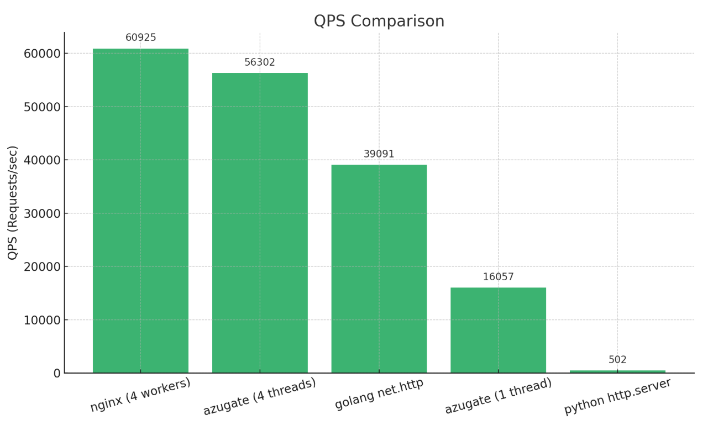

# azugate

### Features

- HTTP(S) proxy support (local files and remote resources)
- WebSocket support
- HTTP Gzip compression and chunked transfer encoding
- Rate limiting
- OAuth integration via Auth0
- Management through gRPC API
- Linux sendfile() optimization
- High-performance asynchronous I/O

### Build

The system uses Go as the application layer, interfacing with a C++ core via CGO bindings.
The azugate core requires a compiler that supports C++20, CMake and vcpkg.
The shell requires a go compiler.
It has been tested on Apple Silicon(M2) Macs and x86-64 Linux.
 
```bash
  # 1. Build azugate core
  cd core
  make all
  
  # 2. Build shell
  cd ..
  go build -ldflags="-s -w" ./cmd/azugate
```

### Dev Tools

#### wrk

```bash
  wrk -t1 -c20 -d10s http://localhost:5080
```

### Perf

```bash
 # CPU: 12th Gen Intel(R) Core(TM) i5-12600K
 # Cores: 2
 # Command: 
 wrk -c400 -t4 -d5s http://172.17.0.2:8080/login/login.html
```



